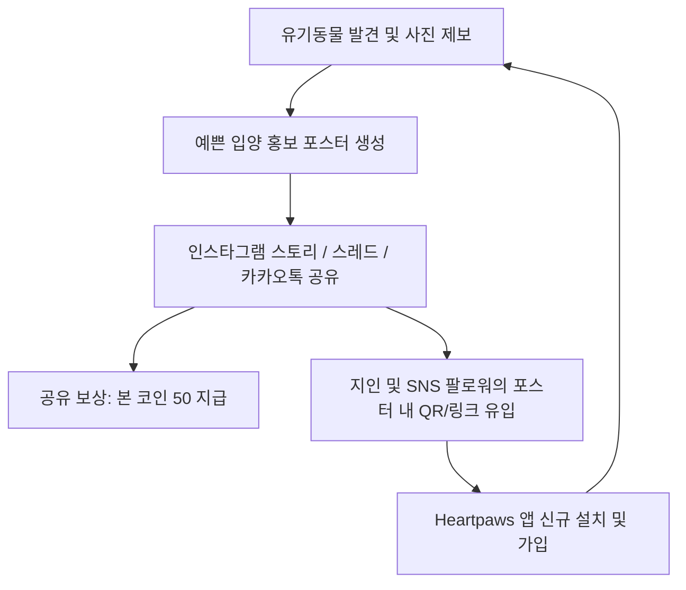

# 🚀 Heartpaws iOS 출시 & 초기 유저 유입 활성화 마케팅 전략

본 문서는 **Heartpaws(하트포즈)**의 iOS 출시와 동시에 타겟 유저(반려인, 유기동물 관심층, 2030 세대)를 빠르게 확보하고 바이럴 확산을 일으키기 위한 실전 그로스(Growth) 전략서입니다.

---

## 1. ASO (앱스토어 검색 최적화) 전략

초기 오가닉(자연 유입) 다운로드를 극대화하기 위해 검색량이 높고 전환율이 좋은 핵심 키워드를 선점합니다.

### A. 키워드 구성 (App Store Keyword Strategy)
* **메인 타겟 키워드**:
  - `유기견 입양`, `유기묘 입양`, `길고양이`, `유기동물 제보`, `포인핸드`, `동물보호소`, `강아지 무료분양`, `고양이 임보`, `반려동물 도감`
* **타이틀 조합**: `Heartpaws - 유기동물 발견 및 입양`
* **서브타이틀 조합**: `동네 유기동물 지도 제보 & 입양 커뮤니티`

### B. 고전환 스크린샷 5종 비주얼 카피
1. **1번 스크린샷 (지도)**: *"내 주변에서 가족을 기다리는 아이들을 찾아보세요"* (위치 기반 실시간 지도)
2. **2번 스크린샷 (제보/사진)**: *"길에서 마주친 유기동물, 사진 한 장으로 생명을 구하세요"* (AI 품종/위치 자동 제보)
3. **3번 스크린샷 (입양 포스터)**: *"터치 한 번으로 완성되는 감성 입양 홍보 포스터"* (SNS 공유 바이럴)
4. **4번 스크린샷 (가상 펫 꾸미기)**: *"나만의 가상 반려동물을 키우고 배지를 모아보세요"* (귀여운 액세서리 & 레벨업)
5. **5번 스크린샷 (입양 도감)**: *"전국 보호소 공공데이터 실시간 연동"* (품종, 성별, 나이 맞춤 필터)

---

## 2. 바이럴 루프 (Viral Growth Loop)

유저가 앱을 사용하는 행위 자체가 자연스럽게 다른 유저를 유입시키는 선순환 구조를 만듭니다.



* **인스타그램 스토리 & 스레드 템플릿**:
  - 포스터 하단에 `Heartpaws 앱에서 [아이 이름]의 실시간 구조 상황 확인하기` 문구와 깔끔한 딥링크 QR코드 자동 렌더링.
* **공유 리워드 게이미피케이션**:
  - 입양 포스터 SNS 공유 시 '본 코인(Bone Coins)' 즉시 지급 ➔ 가상 펫 먹이 구매 및 전용 액세서리 언락으로 리텐션 강화.

---

## 3. 커뮤니티 & 인플루언서 시딩 (Seeding)

### A. 타겟 커뮤니티
* **네이버 대형 반려동물 카페**:
  - *강사모* (회원 200만+): '유기견 돕는 새로운 무료 앱 소개해 드립니다' 진정성 스토리텔링
  - *고양이라서 다행이야* (회원 100만+): '동네 길냥이 밥자리/임보 정보 기록하기 좋은 앱'
* **디시인사이드**: 멍멍이 갤러리, 야옹이 갤러리

### B. 인스타그램 유기견 임보/구조 봉사자 협업 제안 (DM 템플릿)
```text
안녕하세요 [계정명]님! 항상 유기동물 구조와 따뜻한 임보 소식 보며 많은 감동을 받고 있습니다. 🐾

다름이 아니라, 길거리의 작은 생명들을 돕기 위해 개발된 무료 앱 'Heartpaws(하트포즈)' 팀입니다. 
[계정명]님께서 임보/보호 중이신 아이들의 소중한 가족을 더 빨리 찾으실 수 있도록, 
Heartpaws 앱 내 지도 상단 긴급 배너 및 인스타그램 스토리용 전용 포스터를 무료로 적극 홍보해 드리고 싶습니다!

아이들의 입양 공고를 Heartpaws에 등록해주시면 전폭적으로 노출을 지원해 드리겠습니다. 언제든 편하게 답장 부탁드립니다! 🙏
```

---

## 4. 숏폼 콘텐츠 템플릿 (Reels / Shorts / TikTok)

### 시나리오 1: "동네 유기동물 지도 열어봤다가 눈물 난 썰"
* **0~3초 (Hook)**: *"우리 동네에 이렇게 많은 길고양이와 유기견이 살고 있었다고...?"* (Heartpaws 지도 줌아웃 연출)
* **3~10초 (Feature)**: 길에서 발견한 강아지 사진을 찍자마자 자동으로 귀여운 입양 포스터가 만들어지는 과정 시연
* **10~15초 (CTA)**: *"동네 동물들을 함께 지켜주세요. 프로필 링크에서 Heartpaws 다운로드!"*

### 시나리오 2: "게임처럼 유기동물을 돕는 방법"
* **0~3초 (Hook)**: *"포켓몬 GO처럼 길거리 동물 찾고, 진짜로 돕는 앱이 나왔다?!"*
* **3~10초 (Feature)**: 펫 도감(Petdex) 등록 ➔ 가상 펫에게 뼈다귀 먹이주기 ➔ 레벨업과 기부 배지 획득 흐름
* **10~15초 (CTA)**: *"내 작은 관심이 아이들의 든든한 사료가 됩니다."*

---

## 5. 런칭 이벤트 및 초기 리텐션 전략

1. **신규 가입 웰컴 보너스**: 가입 즉시 `500 Bone Coins` 지급
2. **첫 제보 축하 리워드**: 첫 동물 제보 시 특별 배지 *"첫걸음 구조대원"* 지급
3. **7일 연속 출석 & 밥주기 챌린지**: 가상 펫 성장 속도 2배 부스트 제공
